# Epic Worker Manager: Post-PR Lifecycle Implementation Plan

> **For agentic workers:** REQUIRED SUB-SKILL: Use superpowers:subagent-driven-development (recommended) or superpowers:executing-plans to implement this plan task-by-task. Steps use checkbox (`- [ ]`) syntax for tracking.

**Goal:** Extend `/epic-worker-manager` with review handling, CI monitoring, and merge orchestration so the full epic-to-merge workflow runs from a single invocation.

**Architecture:** All changes are to a single file — `~/.claude/skills/epic-worker-manager/SKILL.md`. We add Steps 7-9 after the existing Step 6, update the workflow diagram, arguments, guardrails, error handling, and integration sections. No other skills are modified.

**Tech Stack:** Markdown (skill definition), Graphviz DOT (workflow diagram), GitHub CLI (`gh`), GraphQL API

---

### Task 1: Update Arguments and Description

**Files:**
- Modify: `~/.claude/skills/epic-worker-manager/SKILL.md:1-19`

- [ ] **Step 1: Update the frontmatter description**

Add mention of the full lifecycle (review, CI, merge) to the skill description so it triggers on phrases like "run the full lifecycle", "merge the epic PRs", "address reviews and merge":

```markdown
---
name: epic-worker-manager
description: Use when the user wants to run, execute, or dispatch an entire phase of a GitHub epic in parallel — implementing multiple issues concurrently by spinning up one agent per issue, then orchestrating PR review handling, CI monitoring, and merging. Triggers on "run phase N", "dispatch agents for the epic", "parallelize the epic", "fan out the issues", "batch the epic", "work on all issues in phase N", "spin up workers for each issue", "run epic-worker on all phase N issues", "knock out the remaining tickets in parallel", "address reviews and merge the epic PRs", or "run the full lifecycle for the epic". NOT for working on a single issue (use epic-worker), NOT for creating/planning an epic (use create-epic), NOT for general parallel tasks unrelated to epics (use dispatching-parallel-agents).
---
```

- [ ] **Step 2: Update the Arguments section**

Replace the existing Arguments block (lines 10-19) with:

```markdown
## Arguments

\```
/epic-worker-manager <LABEL> <PHASE> [--dry-run] [--skip-reviews] [--skip-ci]
\```

- `LABEL` (required): GitHub label grouping the epic's issues (e.g., `billing-v1`)
- `PHASE` (required): Phase number to implement (e.g., `1`, `2`)
- `--dry-run` (optional): Show the dispatch plan (batches, file overlaps) without launching agents
- `--skip-reviews` (optional): Skip Step 7 (review phase) entirely — useful if PRs don't need Copilot review
- `--skip-ci` (optional): Skip Step 8 (CI watch phase), go straight from reviews to merge phase
```

- [ ] **Step 3: Update the opening paragraph**

Replace the single-line description after the `# Epic Worker Manager` heading:

```markdown
# Epic Worker Manager

Orchestrate the full lifecycle of a GitHub epic phase: identify issues, detect file overlaps, dispatch parallel implementation agents, handle PR review feedback, monitor CI, and merge in the right order. One command from issue to merged code.
```

- [ ] **Step 4: Verify the edit**

Read back lines 1-25 of the file and confirm the frontmatter, heading, and arguments are correct.

- [ ] **Step 5: Commit**

```bash
git add ~/.claude/skills/epic-worker-manager/SKILL.md
git commit -m "feat(epic-worker-manager): update description and arguments for post-PR lifecycle"
```

---

### Task 2: Update the Workflow Diagram

**Files:**
- Modify: `~/.claude/skills/epic-worker-manager/SKILL.md:20-56` (the `digraph manager` block)

- [ ] **Step 1: Replace the workflow diagram**

Replace the entire `digraph manager` DOT block with this expanded version that includes Steps 7-9:

```dot
digraph manager {
    rankdir=TB;
    node [fontname="Helvetica" fontsize=10];

    "Sync main" [shape=box];
    "Fetch phase issues" [shape=box];
    "None found?" [shape=diamond];
    "Phase complete" [shape=doublecircle];
    "Analyze file overlaps" [shape=box style=filled fillcolor=lightblue];
    "Build dispatch plan" [shape=box];
    "Show plan to user" [shape=box style=filled fillcolor=lightyellow];
    "Dry run?" [shape=diamond];
    "Stop" [shape=doublecircle];
    "Dispatch parallel batch" [shape=box style=filled fillcolor=lightgreen];
    "Wait / implement fallback" [shape=box];
    "More batches?" [shape=diamond];
    "Phase summary" [shape=box style=filled fillcolor=lightyellow];
    "Skip reviews?" [shape=diamond];
    "Review checkpoint (round N)" [shape=box style=filled fillcolor=lightyellow];
    "Dispatch address-pr-review agents" [shape=box style=filled fillcolor=lightgreen];
    "Round 2?" [shape=diamond];
    "Re-request Copilot + checkpoint" [shape=box style=filled fillcolor=lightyellow];
    "Skip CI?" [shape=diamond];
    "Dispatch CI-watcher agents" [shape=box style=filled fillcolor=lightgreen];
    "CI results" [shape=box style=filled fillcolor=lightyellow];
    "Present merge order" [shape=box style=filled fillcolor=lightyellow];
    "User approves?" [shape=diamond];
    "Merge PRs sequentially" [shape=box style=filled fillcolor=lightcoral];
    "Done" [shape=doublecircle];

    "Sync main" -> "Fetch phase issues";
    "Fetch phase issues" -> "None found?";
    "None found?" -> "Phase complete" [label="yes"];
    "None found?" -> "Analyze file overlaps" [label="no"];
    "Analyze file overlaps" -> "Build dispatch plan";
    "Build dispatch plan" -> "Show plan to user";
    "Show plan to user" -> "Dry run?";
    "Dry run?" -> "Stop" [label="yes"];
    "Dry run?" -> "Dispatch parallel batch" [label="no"];
    "Dispatch parallel batch" -> "Wait / implement fallback";
    "Wait / implement fallback" -> "More batches?" [label="batch done"];
    "More batches?" -> "Dispatch parallel batch" [label="yes"];
    "More batches?" -> "Phase summary" [label="no"];
    "Phase summary" -> "Skip reviews?";
    "Skip reviews?" -> "Skip CI?" [label="--skip-reviews"];
    "Skip reviews?" -> "Review checkpoint (round N)" [label="no"];
    "Review checkpoint (round N)" -> "Dispatch address-pr-review agents";
    "Dispatch address-pr-review agents" -> "Round 2?";
    "Round 2?" -> "Re-request Copilot + checkpoint" [label="round 1 done"];
    "Re-request Copilot + checkpoint" -> "Dispatch address-pr-review agents";
    "Round 2?" -> "Skip CI?" [label="round 2 done"];
    "Skip CI?" -> "Present merge order" [label="--skip-ci"];
    "Skip CI?" -> "Dispatch CI-watcher agents" [label="no"];
    "Dispatch CI-watcher agents" -> "CI results";
    "CI results" -> "Present merge order";
    "Present merge order" -> "User approves?";
    "User approves?" -> "Done" [label="no, user adjusts"];
    "User approves?" -> "Merge PRs sequentially" [label="yes"];
    "Merge PRs sequentially" -> "Done";
}
```



- [ ] **Step 2: Verify the diagram**

Read back the diagram section and confirm all nodes and edges are present, including the new Steps 7-9 flow.

- [ ] **Step 3: Commit**

```bash
git add ~/.claude/skills/epic-worker-manager/SKILL.md
git commit -m "feat(epic-worker-manager): update workflow diagram with review, CI, and merge phases"
```

---

### Task 3: Add Step 7 — Review Phase

**Files:**
- Modify: `~/.claude/skills/epic-worker-manager/SKILL.md` (insert after the existing Step 6 section, before Guardrails)

- [ ] **Step 1: Add the Step 7 section**

Insert the following after the Step 6 "Merge-order logic" subsection and before the `## Guardrails` section:

```markdown
### Step 7: Review Phase

After the phase summary, transition to review handling. If `--skip-reviews` was passed, skip to Step 8.

#### PR discovery

If this step runs as part of a full lifecycle (after Step 6), use the PR list from the phase summary. If earlier steps were skipped (e.g., running with `--skip-reviews` removed mid-conversation, or re-invoking for merge only), re-derive the PR list by querying GitHub:

\```bash
gh pr list --label "LABEL" --state open --json number,title,headRefName,url \
  --jq '[.[] | select(.title | test("LABEL|phase"))]'
\```

Alternatively, find PRs whose body contains `Closes #N` for issues carrying the epic label.

#### Review checkpoint (used for both rounds)

Prompt the user and simultaneously spawn a background review-poller:

\```
Review round N ready. 4 PRs awaiting Copilot review:
  PR #210 — Add billing endpoint
  PR #211 — Stripe webhook handler
  PR #212 — Add billing tests
  PR #213 — Billing rate limits

Waiting for Copilot reviews. Say "go" when ready,
or I'll auto-check in ~10 minutes.
\```

**Background review-poller:** Spawn a background agent (`run_in_background: true`) that:
1. Waits 10 minutes (`sleep 600`)
2. Checks each PR for Copilot reviews via GraphQL:

\```bash
gh api graphql -f query='
{
  repository(owner: "OWNER", name: "REPO") {
    pullRequest(number: PR_NUM) {
      reviews(last: 10) {
        nodes { author { login } state submittedAt }
      }
    }
  }
}'
\```

3. If all PRs have Copilot reviews, reports back — this triggers the round (same as user saying "go")
4. If not all reviewed, retries twice more at 5-minute intervals, then reports partial status and waits for user

Whichever comes first — user saying "go" or the poller detecting reviews — triggers the round.

#### Round execution

For each PR with unresolved review threads, dispatch an `address-pr-review` agent:

\```
Agent(
  isolation: "worktree",
  run_in_background: true,
  prompt: "Read and execute the address-pr-review skill at
           /root/.claude/skills/address-pr-review/SKILL.md
           for PR #NNN in OWNER/REPO. The repo root is REPO_ROOT."
)
\```

PRs with zero unresolved threads are skipped — no agent dispatched.

**Note on `isolation: "worktree"`:** Step 5 warns against worktree isolation for `epic-worker` agents because `epic-worker` manages its own worktree internally. Here, `address-pr-review` is designed for the worktree execution model, so `isolation: "worktree"` is correct.

#### After round 1

Re-request Copilot review on all PRs:

\```bash
gh api repos/OWNER/REPO/pulls/PR_NUM/requested_reviewers \
  -f 'reviewers[]=copilot' -X POST
\```

Report round 1 results, then enter the same checkpoint pattern for round 2.

#### After round 2

Report results and proceed directly to Step 8 (no user checkpoint):

\```
Review phase complete:
  PR #210 — 3 threads resolved (R1), 1 resolved (R2)
  PR #211 — 1 thread resolved (R1), 0 threads (R2)
  PR #212 — No feedback either round
  PR #213 — 2 resolved, 1 pushed back (R1), 1 resolved (R2)

Proceeding to CI watch...
\```
```

- [ ] **Step 2: Verify the edit**

Read back the Step 7 section and confirm all subsections are present: PR discovery, review checkpoint, background poller, round execution, after round 1, after round 2.

- [ ] **Step 3: Commit**

```bash
git add ~/.claude/skills/epic-worker-manager/SKILL.md
git commit -m "feat(epic-worker-manager): add Step 7 review phase with 2-round Copilot review cycle"
```

---

### Task 4: Add Step 8 — CI Watch Phase

**Files:**
- Modify: `~/.claude/skills/epic-worker-manager/SKILL.md` (insert after Step 7, before Guardrails)

- [ ] **Step 1: Add the Step 8 section**

Insert after Step 7's "After round 2" subsection:

```markdown
### Step 8: CI Watch Phase

If `--skip-ci` was passed, skip to Step 9.

Dispatch one CI-watcher agent per PR, all in parallel with `run_in_background: true` and `isolation: "worktree"` (agents need an isolated workspace to fix code if CI fails).

#### CI-watcher agent prompt

\```
Agent(
  isolation: "worktree",
  run_in_background: true,
  prompt: |
    You are monitoring CI for PR #NNN in OWNER/REPO (branch: BRANCH).

    1. Run `gh pr checks NNN --watch` to wait for all CI checks to finish
    2. If all checks pass, report success and stop
    3. If any checks fail:
       a. Read the failure logs via `gh run view RUN_ID --log-failed`
       b. Diagnose the root cause
       c. Check out the PR branch, fix the issue, commit, and push
       d. Run `gh pr checks NNN --watch` again
    4. Repeat until CI is green or you determine you're stuck
       (same failure repeating, fix is beyond your scope)
    5. Report final status: success, fixed (with details), or failed (with diagnosis)

    The repo root is REPO_ROOT.
)
\```

#### After all watchers return

Collect and report CI status:

\```
CI Status:
  ✓ PR #210 — All checks passing
  ✓ PR #211 — All checks passing (fixed: lint error on line 42)
  ✓ PR #212 — All checks passing
  ✗ PR #213 — Failing: integration test timeout (agent could not resolve)

3/4 green, 1 needs manual attention
\```

PRs with failed CI are excluded from the merge phase and flagged for manual follow-up.
```

- [ ] **Step 2: Verify the edit**

Read back the Step 8 section and confirm the agent prompt and results collection are present.

- [ ] **Step 3: Commit**

```bash
git add ~/.claude/skills/epic-worker-manager/SKILL.md
git commit -m "feat(epic-worker-manager): add Step 8 CI watch phase with auto-fix loop"
```

---

### Task 5: Add Step 9 — Merge Phase

**Files:**
- Modify: `~/.claude/skills/epic-worker-manager/SKILL.md` (insert after Step 8, before Guardrails)

- [ ] **Step 1: Add the Step 9 section**

Insert after Step 8's "After all watchers return" subsection:

```markdown
### Step 9: Merge Phase

Present the merge order (using the same merge-order logic from Step 6) along with CI status, then wait for user approval.

#### Present merge order

\```
All CI green. Ready to merge 3 PRs:

Recommended merge order:
  1. PR #212 — Add billing tests (tests only, no conflicts)
  2. PR #211 — Stripe webhook handler (independent)
  3. PR #210 — Add billing endpoint (billing.py, routes.py)

Excluded:
  PR #213 — CI failing, needs manual attention

Approve to merge in this order, or adjust the sequence.
\```

Wait for user approval before merging. The user may adjust the order or exclude additional PRs.

#### On user approval

Merge PRs sequentially in the approved order:

\```bash
gh pr merge PR_NUM --merge --delete-branch
\```

Merges are sequential because later PRs in overlap chains depend on earlier ones being landed first. Between merges, GitHub needs a moment to process — check that the merge completed before moving to the next PR.

**If a merge fails** (e.g., merge conflict from an external commit on main, or a required status check not passing), stop the merge sequence immediately. Report which PR failed, the reason, and which PRs remain unmerged. Ask the user how to proceed rather than continuing blindly.

\```
Merge progress:
  ✓ PR #212 — Merged
  ✓ PR #211 — Merged
  ✗ PR #210 — FAILED: merge conflict in billing.py
  — PR #213 — Skipped (blocked by #210 failure)

PR #210 has a merge conflict. Resolve manually, or I can attempt a rebase.
\```
```

- [ ] **Step 2: Verify the edit**

Read back the Step 9 section and confirm the merge order presentation, user approval gate, and failure handling are present.

- [ ] **Step 3: Commit**

```bash
git add ~/.claude/skills/epic-worker-manager/SKILL.md
git commit -m "feat(epic-worker-manager): add Step 9 merge phase with user approval gate"
```

---

### Task 6: Update Guardrails, Error Handling, and Integration

**Files:**
- Modify: `~/.claude/skills/epic-worker-manager/SKILL.md` (Guardrails, Error Handling, and Integration sections)

- [ ] **Step 1: Update the Guardrails section**

Replace the existing `## Guardrails` section with:

```markdown
## Guardrails

- **Always show the plan** before dispatching — the user must confirm
- **Never dispatch issues that are already assigned** — another agent or human is working on them
- **Continue on failure** — one agent failing doesn't block others; report failures in the summary
- **Never merge without user approval** — the merge checkpoint in Step 9 is mandatory
- **Exclude failed PRs from later phases** — implementation failures skip review; CI failures skip merge
- **2 review rounds is the default** — not configurable for now
- **Background pollers are fire-and-forget** — if the user says "go" first, the poller result is ignored
- **Merge failures halt the sequence** — don't continue merging if one fails; surface to user
- **Respect phase boundaries** — only dispatch issues in the requested phase, even if later phases have unblocked issues
- **Check for stale issues** — if an issue's acceptance criteria are already met on main, close it rather than dispatching an agent
```

- [ ] **Step 2: Update the Error Handling table**

Replace the existing `## Error Handling` section with:

```markdown
## Error Handling

| Situation | Action |
|-----------|--------|
| No issues found for phase | Report phase complete |
| All issues already assigned | Report in-progress status, suggest waiting |
| Issue already resolved on main | Comment, close, exclude from dispatch |
| Agent fails with permission error | Retry once, then implement directly |
| Agent fails mid-implementation | Record failure, continue with other agents |
| Issue body has no file references | Treat as independent (Batch 1) |
| Only one issue in phase | Dispatch single agent (still useful for worktree isolation) |
| User declines the plan | Stop, let user adjust |
| `git pull` fails with divergent branches | Use `git pull --rebase` |
| address-pr-review agent fails | Record failure, include PR in round 2 retry |
| PR has no review threads | Skip in that round |
| CI-watcher agent fails (not CI, agent itself) | Report, exclude from merge, flag for manual |
| Merge conflict on a PR | Stop merge sequence, report to user |
| Background poller can't detect reviews after 3 retries | Report partial status, wait for user |
| All PRs excluded (all failed) | Report phase outcome, stop |
```

- [ ] **Step 3: Update the Integration section**

Replace the existing `## Integration` section with:

```markdown
## Integration

**Required skills (used by dispatched agents):**
- **epic-worker** — each agent runs this to implement its issue (Step 5)
- **address-pr-review** — review-handling agents (Step 7)
- **superpowers:using-git-worktrees** — called by epic-worker for isolation
- **superpowers:requesting-code-review** — called by epic-worker before PR
- **superpowers:finishing-a-development-branch** — called by epic-worker for PR creation

**Pairs with:**
- **create-epic** — creates the epic with phased, labeled issues that this skill dispatches
- **epic-worker** — implements individual issues; this skill orchestrates multiple instances
- **epic-completion** — validates and closes the epic after all phases are merged
```

- [ ] **Step 4: Verify all three sections**

Read back the Guardrails, Error Handling, and Integration sections. Confirm no duplicate entries and all new items are present.

- [ ] **Step 5: Commit**

```bash
git add ~/.claude/skills/epic-worker-manager/SKILL.md
git commit -m "feat(epic-worker-manager): update guardrails, error handling, and integration for full lifecycle"
```

---

### Task 7: Final Review

**Files:**
- Read: `~/.claude/skills/epic-worker-manager/SKILL.md` (full file)

- [ ] **Step 1: Read the complete updated skill**

Read the entire file top-to-bottom. Check for:
- Consistent step numbering (0-9)
- No orphaned references to "Don't merge PRs" guardrail (replaced)
- Diagram matches the step descriptions
- Arguments section matches what Steps 7-9 check for
- No duplicate sections or content

- [ ] **Step 2: Verify skill loads correctly**

Test that the skill's frontmatter is valid YAML by checking the `---` delimiters are intact and the description field is properly formatted (single line, no unescaped special characters).

- [ ] **Step 3: Commit any fixes**

If any issues were found in steps 1-2, fix and commit:

```bash
git add ~/.claude/skills/epic-worker-manager/SKILL.md
git commit -m "fix(epic-worker-manager): polish final skill after review"
```
